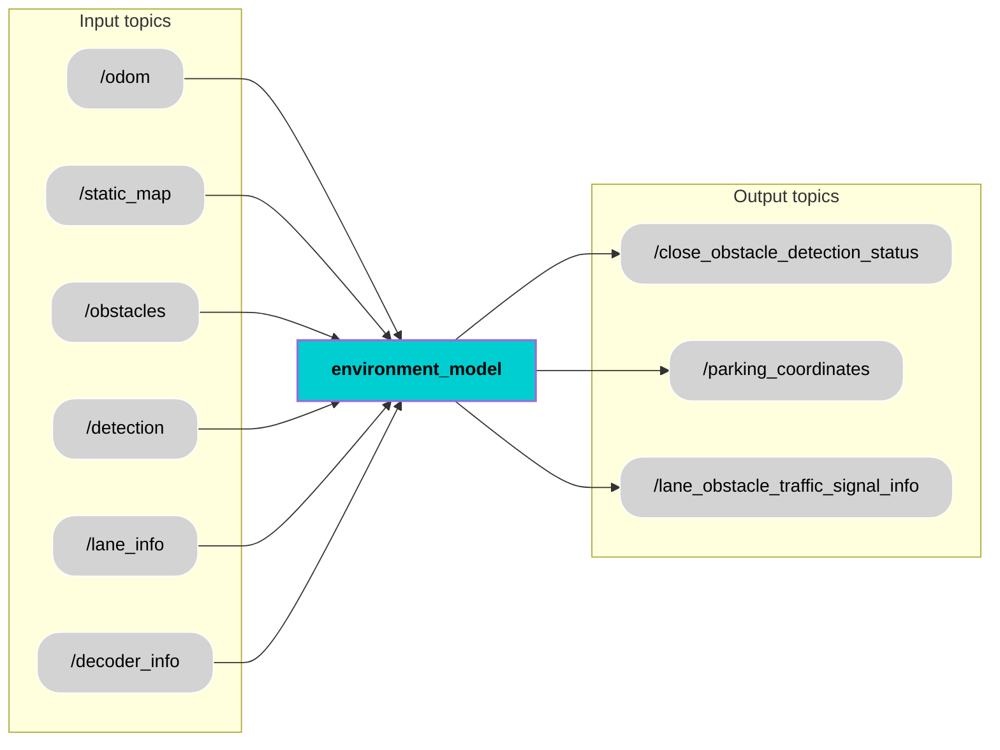

  <h1 style="font-size: 36px;">Environment Model</h1>

## 📚 Contents
- [Description](#-description)
- [Architecture](#-architecture)
- [Interfaces](#-interfaces)
- [User Stories](#-user-stories)
- [Installation](#-installation)
- [Usage](#-usage)
- [Contributor](#-contributor)
- [License](#-license)

## 🧠 Description
The Environment Model node receives multiple inputs from various modules essential for building a comprehensive understanding of the vehicle’s surroundings. These inputs include the ego vehicle's position and velocity data from the `/odom` topic and a 2D grid map from the `/static_map` topic. Obstacle details are gathered from the `/obstacle_detection` topic, while object detections such as pedestrians or vehicles are received via the `/detection` topic. Additionally, lane boundary information comes from `/lane_info`, and V2X data like nearby vehicles, traffic signals, and parking slots are provided through `/decoder_info`.

The primary function of the Environment Model is to fuse data from various perception sources to create an accurate and real-time representation of the driving environment for the autonomous medical shuttle. It processes odometry to understand vehicle dynamics, integrates map data to localize obstacles and lanes, and uses detection and decoder data to recognize dynamic and static objects, including traffic signals and pedestrians. By combining these inputs, the Environment Model identifies potential risks such as close obstacles, calculates suitable parking locations, and interprets lane structures and traffic control information. This enables the shuttle to make safe and informed decisions while navigating complex environments such as urban roads.

Based on its integrated environmental understanding, the Environment Model node provides several outputs to other functional modules. It publishes a boolean status on `/close_obstacle_detection_status` to indicate the presence of nearby obstacles for the Decision Core. The best available parking coordinates are sent via the `/parking_coordinates` topic for use in path planning. Additionally, the model outputs comprehensive lane, obstacle, and traffic signal information on `/lane_obstacle_traffic_signal_info`, which supports the Lateral and Longitudinal Control module in safely maneuvering the vehicle.

## 🧩 Architecture

## 🔌 Interfaces

### Topics:
| Name                          |IO | Type                 | Description                                                              |
|------------------------------|-----|-----------------|--------------------------------------------------------------------------|
| `/odom`    | Input |`nav_msgs/msg/Odometry.msg`      | Provides position and velocity of ego vehicle                    |
| `/static_map`  |Input |`nav_msgs/msg/OccupancyGrid.msg`      | Provides 2-D grid map                    |
| `/obstacle_detection`     | Input|`custom_msgs/msg/ObstacleDetectionArray.msg`      | Provides angles and ranges                    |
| `/detection`    |Input |`vision_msgs/msg/Detection2DArray.msg`      | Array of 2D detecttions with class labels and confidence score                    |
| `/lane_info`      | Input|`custom_msgs/msg/LaneInfo.msg`      | Contains detected left, right, and center lane boundaries, angle, curvature,width, and confidence.                  |
| `/decoder_info`     | Input|`custom_msgs/msg/DecoderInfo.msg`      | Provides structured V2X data such as nearby vehicles, pedestrians, emergency events, traffic signal position & status and parking slot cordinates.                    |
| `/close_obstacle_detection_status`| Output | `std_msgs/msg/Bool.msg`      | Provides boolean value indicating the presence of very close obstacle                     |
| `/parking_coordinates`   |   Output     | `geometry_msgs/msg/posestamped.msg`      | Provides nearest and available parking coordinates                     |
| `/lane_obstacle_traffic_signal_info` | Output |`custom_msgs/msg/LaneObstacleTrafficSignalArray.msg`      | Provides data related to lane, obstacles and traffic signals                     |

### Custom messages:
#### Message: [`ObstacleDetectionArray.msg`](https://git.hs-coburg.de/pax_auto/obstacle_detection#message-obstacledetectionarraymsg)
#### Message: [`LaneInfo.msg`](https://git.hs-coburg.de/pax_auto/lane_detection#message-laneinfomsg)
#### Message: [`DecoderInfo.msg`](https://git.hs-coburg.de/pax_auto/decoder#message-decoder_infomsg)
#### Message: `LaneObstacleTrafficSignalArray.msg.msg`
| Name                          | Type                 | Description                                                              |
|------------------------------|----------------------|--------------------------------------------------------------------------|
| `lane`      | [`LaneInfo[]`](https://git.hs-coburg.de/pax_auto/lane_detection#message-laneinfomsg)      |   Array of lanes which contains detected left, right, and center lane boundaries, angle, curvature,width, and confidence.                 |
| `obstacles`  |  [`ObstacleDetectionData[]`](https://git.hs-coburg.de/pax_auto/obstacle_detection#message-obstacledetectiondatamsg) | Array of obstacles with unique ID, position and distance        |
|  `traffic_signal_location` |  `string[]` |  Traffic signal locations       |
|  `traffic_signal_status` |  `string[]` |   Traffic Signal status for the corresponding locations         |

### Interface test process:
Will be implemented in next Module.

## 🎯 User Stories
Will be created in next Module
 
## 🛠️ Installation
ROS2 package will be implemented in next Module.

## ▶️ Usage
ROS2 package will be implemented in next Module.

## 🧑‍💻 Contributor
[Surendrakumar Koganti](https://git.hs-coburg.de/sur7933s)

## 🔒 License
Licensed under the **Apache 2.0 License**. See [LICENSE](LICENSE) for details.
